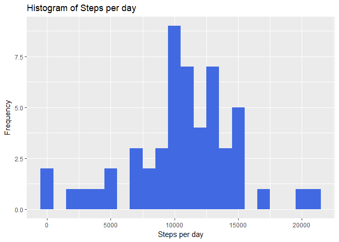
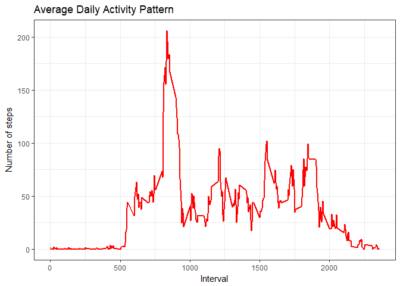
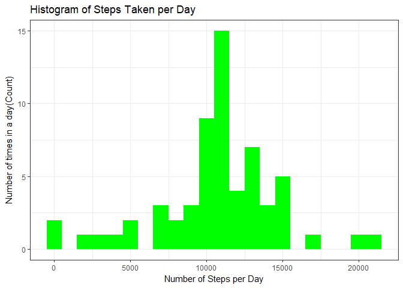
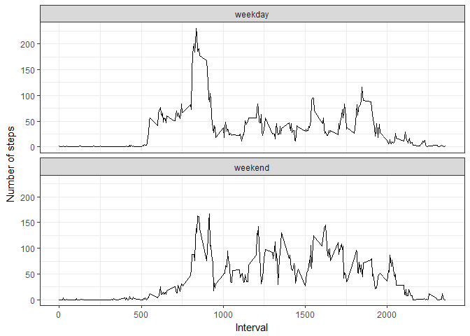

## Loading and preprocessing the data

### Loading necesarry libraries

```r
library(ggplot2)
library(plyr)
```
### Reading data table

```r
rdata <- read.csv('activity.csv', header = TRUE, sep = ",",
                  colClasses=c("numeric", "character", "numeric"))
```

### Cleaning the data


```r
rdata$date <- as.Date(rdata$date, format = "%Y-%m-%d")
rdata$interval <- as.factor(rdata$interval)
```

###Structure of the data


```r
str(rdata)
```

```
## 'data.frame':	17568 obs. of  3 variables:
##  $ steps   : num  NA NA NA NA NA NA NA NA NA NA ...
##  $ date    : Date, format: "2012-10-01" "2012-10-01" ...
##  $ interval: Factor w/ 288 levels "0","5","10","15",..: 1 2 3 4 5 6 7 8 9 10 ...
```

## What is mean total number of steps taken per day?

### Summary of steps taken


```r
steps_per_day <- aggregate(steps ~ date, rdata, sum)
colnames(steps_per_day) <- c("date","steps")
head(steps_per_day)
```

```
##         date steps
## 1 2012-10-02   126
## 2 2012-10-03 11352
## 3 2012-10-04 12116
## 4 2012-10-05 13294
## 5 2012-10-06 15420
## 6 2012-10-07 11015
```

### Histogram of steps take every day


```r
ggplot(steps_per_day, aes(x = steps)) +
  geom_histogram(fill = "royalblue", binwidth = 1000) +
  labs(title = "Histogram of Steps per day", x = "Steps per day", y = "Frequency")
```

<!-- -->

### Find the mean and median number of steps

```r
steps_mean <- mean(steps_per_day$steps, na.rm = TRUE)
steps_median <- median(steps_per_day$steps, na.rm = TRUE)  
steps_mean  
```

```
## [1] 10766.19
```

```r
steps_median
```

```
## [1] 10765
```

## What is the average daily activity pattern?

###Calculate the 5-minute intervals


```r
steps_per_interval <- aggregate(rdata$steps, by = list(interval = rdata$interval),
                                FUN = mean, na.rm = TRUE)
```

### Convert to integers for plotting


```r
steps_per_interval$interval <- 
        as.integer(levels(steps_per_interval$interval)[steps_per_interval$interval])
colnames(steps_per_interval) <- c("interval", "steps")
```

### Plot average steps per interval


```r
ggplot(steps_per_interval, aes(x=interval, y=steps)) +   
        geom_line(color="red", size=1) +  
        labs(title="Average Daily Activity Pattern", x="Interval", y="Number of steps") +  
        theme_bw()
```

<!-- -->

### Find interval with max steps


```r
max_interval <- steps_per_interval[which.max(steps_per_interval$steps),]
max_interval
```

```
##     interval    steps
## 104      835 206.1698
```

## Imputing missing values
### Finding total number of missing values

```r
missing_Vals <- sum(is.na(rdata$steps))
missing_Vals
```

```
## [1] 2304
```

### Filling missing values

```r
na_fill <- function(data, pervalue) {
        na_index <- which(is.na(data$steps))
        na_replace <- unlist(lapply(na_index, FUN=function(idx){
                interval = data[idx,]$interval
                pervalue[pervalue$interval == interval,]$steps
        }))
        fill_steps <- data$steps
        fill_steps[na_index] <- na_replace
        fill_steps
}

rdata_fill <- data.frame(  
        steps = na_fill(rdata, steps_per_interval),  
        date = rdata$date,  
        interval = rdata$interval)
```

### Structure of filled dataset

```r
str(rdata_fill)
```

```
## 'data.frame':	17568 obs. of  3 variables:
##  $ steps   : num  1.717 0.3396 0.1321 0.1509 0.0755 ...
##  $ date    : Date, format: "2012-10-01" "2012-10-01" ...
##  $ interval: Factor w/ 288 levels "0","5","10","15",..: 1 2 3 4 5 6 7 8 9 10 ...
```

### Verify there are no NAs

```r
missing_Vals <- sum(is.na(rdata_fill$steps))
missing_Vals
```

```
## [1] 0
```

### Histogram of steps per day after NA fill
### Preparing data

```r
fill_steps_per_day <- aggregate(steps ~ date, rdata_fill, sum)
colnames(fill_steps_per_day) <- c("date","steps")
```

### Plotting histogram

```r
ggplot(fill_steps_per_day, aes(x = steps)) + 
       geom_histogram(fill = "green", binwidth = 1000) + 
        labs(title="Histogram of Steps Taken per Day", 
             x = "Number of Steps per Day", y = "Number of times in a day(Count)") + theme_bw()
```

<!-- -->

### New Mean and median after filled data

```r
steps_mean_fill <- mean(fill_steps_per_day$steps, na.rm = TRUE)
steps_median_fill <- median(fill_steps_per_day$steps, na.rm = TRUE)  
steps_mean_fill  
```

```
## [1] 10766.19
```

```r
steps_median_fill
```

```
## [1] 10766.19
```

### Compare mean and median before and after data fill

### Before
- Mean: 1.0766189\times 10^{4}
- Median: 1.0765\times 10^{4}

### After
- Mean: 1.0766189\times 10^{4}
- Median: 1.0766189\times 10^{4}

Yes, there is a slight difference in mean and median after filling missing data.

## Are there differences in activity patterns between weekdays and weekends?

### Converting the filled data to account for day of week.

```r
weekdays_steps <- function(data) {
    weekdays_steps <- aggregate(data$steps, by=list(interval = data$interval),
                          FUN=mean, na.rm=T)
    # convert to integers
    weekdays_steps$interval <- 
            as.integer(levels(weekdays_steps$interval)[weekdays_steps$interval])
    colnames(weekdays_steps) <- c("interval", "steps")
    weekdays_steps
}
```

### Subset data into weekdays and weekend


```r
data_by_weekdays <- function(data) {
    data$weekday <- 
            as.factor(weekdays(data$date)) # weekdays
    weekend_data <- subset(data, weekday %in% c("Saturday","Sunday"))
    weekday_data <- subset(data, !weekday %in% c("Saturday","Sunday"))

    weekend_steps <- weekdays_steps(weekend_data)
    weekday_steps <- weekdays_steps(weekday_data)

    weekend_steps$dayofweek <- rep("weekend", nrow(weekend_steps))
    weekday_steps$dayofweek <- rep("weekday", nrow(weekday_steps))

    data_by_weekdays <- rbind(weekend_steps, weekday_steps)
    data_by_weekdays$dayofweek <- as.factor(data_by_weekdays$dayofweek)
    data_by_weekdays
}

data_weekdays <- data_by_weekdays(rdata_fill)
```

### Plot weekdays and weekend data for comparison

```r
ggplot(data_weekdays, aes(x=interval, y=steps)) + 
        geom_line(color="black") + 
        facet_wrap(~ dayofweek, nrow=2, ncol=1) +
        labs(x="Interval", y="Number of steps") +
        theme_bw()
```

<!-- -->


Weekdays show the highest individual interval in terms of number of steps, 
while weekends, on average, have more intervals over 100 steps. There can be
many explanations for this though one obvious one is the presence of work during
the weekday forcing longer periods of low activity.
